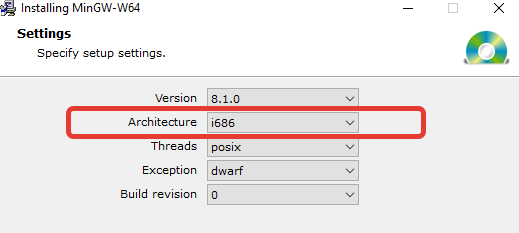
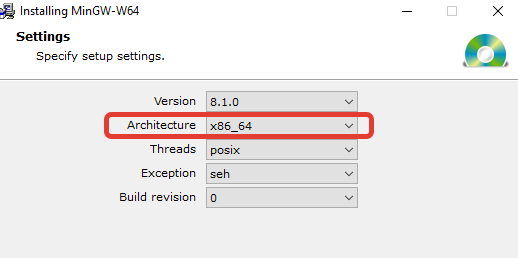
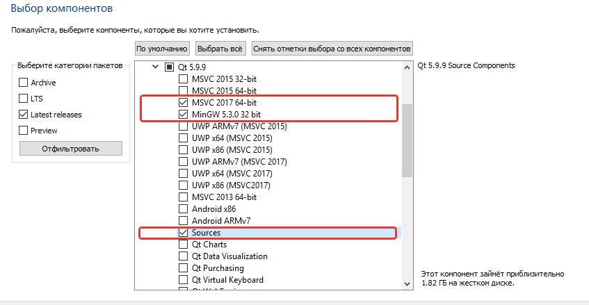

# Пример простейшего GUI приложения (С++/QT)
Пример проекта на базе QT с использованием CMAKE (динамическая и статическая линковка). Чаще всего при разработке приложений на базе QT используется IDE QtCreator, со всеми необходимыми инструментами и магией. Но если вы НЕ хотите использовать QtCreator, а хотите пользоваться своей любимой IDE и при этом разрабатывать приложение на базе QT - это тоже вполне возможно. Данная инструкция расскажет как.

## Сборка под Windows

Для того чтобы запустить проект вам потребуется:

- **IDE с поддержкой [CMake](https://cmake.org/).** Например, [Microsoft Visual Studio](https://visualstudio.microsoft.com/ru/vs/) так и [CLion](https://www.jetbrains.com/clion/)
- **Компилятор С++ с поддержкой как минимум 11-го стандарта а также MAKE.** Если вы пользуетесь Microsoft Visual Studio, то у вас уже установлен необходимый набор инструментов для компиляции и сборки. Если вы пользуетесь CLion, вы можете использовать как компилятор MSVC (если также установлена Visual Studio) либо компилятор [MinGW](https://sourceforge.net/projects/mingw-w64/files/Toolchains%20targetting%20Win32/Personal%20Builds/mingw-builds/installer/mingw-w64-install.exe/download).
  > #####Внимание!
  > Убедитесь что установлены версии MinGW для обеих архитектур (x86 и x64)
  > Для архитектуры x86
  >
  > 
  >
  > Для архитектуры x64
  >
  > 

- **Библиотека QT (в проекте использовалась версия 5.9.9) с исходными кодами.** Вы можете скачать [онлайн-установщик QT](https://www.qt.io/download-qt-installer). Далее необходимо выбрать компоненты которые будут нужны для разработки. Можно выбрать скомпилированную динамическую библиотеку для MSVC и MinGW, а также исходники (Sources) для того чтобы собрать QT статически.
  > 
                                                                                                                                                                                                                                                                                                                                                                                        
  Также пригодится и сам QtCreator, поскольку совместно с ним поставляется QtDesigner для редактирования .ui файлов интерфейса. Но если вы не хотите устанавливать QtDesigner вместе с QtCreator, это можно сделать [отдельно](https://build-system.fman.io/qt-designer-download). Но я не рекомендую делать так, поскольку нет гарантии что вы скачаете актуальную версию. Лучше использовать ту версию, которая идет "из коробки".

Этого по сути достаточно для разработки на базе QT, использованием динамических библиотек (dll). Сконфигурируйте должным образом ваше IDE, укажите пути к QT в файле Calculator/CMakeLists.txt и проект будет готов к сборке.

## Статическая сборка QT

Для разработки вы вполне спокойно можете пользоваться динамической библиотекой, но если вы собираетесь распространять приложение, таскать не маленькие .dll вместе с .exe файлом будет не слишком удобным занятием. Было бы лучше все необходимое упаковать в сам .exe файл. Чтобы это сделать нужно статически линковать библиотеку с приложением, а значит нужна статическая сборка самой библиотеки.

Сколько я не пытался статически собрать библиотеку под GNU/MinGW на Window - ничего не вышло. Это удалось сделать только для MSVC.

Чтобы статически собрать библиотеку под MSVC нам потребуется следующее.

- **[Microsoft Visual Studio](https://visualstudio.microsoft.com/ru/vs/)** - Используются только инструменты компиляции и сборки
- **[Python](https://www.python.org/downloads/windows/)** - Необходимо для сборки
- **[Perl](http://strawberryperl.com/)** - Необходимо для сборки
- **[Jom](https://wiki.qt.io/Jom)** - Используется вместо make, работает быстрее

Итак, приступаем к сборке.

- Убедитесь что пути к **директориям** Python, Perl и Jom добавлены в PATH (переменные среды).
- Запустите Native Tools Command Prompt (в старт-меню найдите по названию, либо запустите .bat находящийся по адресу `C:/Program Files (x86)/Microsoft Visual Studio/2019/Enterprise/VC/Auxiliary/Build/vcvars32.bat`). В зависимости от того, какой Native Tools Command Prompt вы запустите (x86 или x64) получите соответствующую разрядность.
- Перейдите в папку исходников QT командой `cd C:\Qt\версия\Src`
- Создайте директорию для результата сборки, после чего запустите следующую команду

      configure.bat -release -static -no-pch -optimize-size -opengl desktop -platform win32-msvc -prefix "\path\to\Qt\511-static" -skip webengine -nomake tools -nomake tests -nomake examples
  Это конфигурация перед сборкой. Параметры команды означают следующее:
  - `-release` - Тип конфигурации (debug, release)
  - `-static` - Тип сборки (нам нужна статическая)
  - `-no-pch` - Не использовать пред-компилированные заголовки
  - `-optimize-size` - Оптимизировать размер
  - `-opengl desktop` - Тип OpenGL (может быть GL ES, для мобильных устройств, но нам нужен десктопный)
  - `-platform win32-msvc` - Тип платформы (используем MSVC)
  - `-prefix "\path\to\Qt\511-static"` - Путь к результату сборки
  - `-skip webengine` - Не собирать веб-движок
  - `-nomake tests` - Не собирать тесты
  - `-nomake examples` - Не собирать примеры
  
- После окончания конфигурации, если нет никаких ошибок, запускаем команду `jom` для сборки
- После окончания сборки, если нет никаких ошибок, запускаем команду `jom install` для установки библиотеки в указанную ранее директорию результата сборки

### Использование статической сборки QT

Теперь вы можете статически линковать библиотеку со своим приложением, НО есть нюансы которые стоит учесть. Для того чтобы приложение собралось теперь нужно явно указывать .lib (или .a) файлы, причем не только QT. Некоторые системные библиотеки тоже необходимы для сборки. В файле Sources/Calculator/CMakeLists.txt есть перечень необходимых библиотек для данного примера, но в зависимости от того какие возможности библиотеки вы используете этот список может меняться. 

Ниже предоставлен перечень библиотек, которые обычно необходимо явно пролинковать:

    lib/Qt5AccessibilitySupport
    lib/Qt5WindowsUiAutomationSupport
    lib/Qt5ThemeSupport
    lib/Qt5FontDatabaseSupport
    lib/qtpre2
    lib/qtharfbuzz
    lib/qtlibpng
    lib/qtfreetype
    lib/Qt5EventDispatcherSupport
    
    plugins/platforms/qwindows
    
    Dwmapi
    imm32
    netapi32
    wtsapi32
    winmm
    zlib
    bcrypt
    version
    userenv

